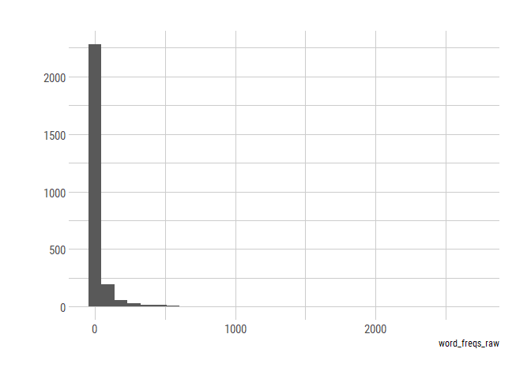
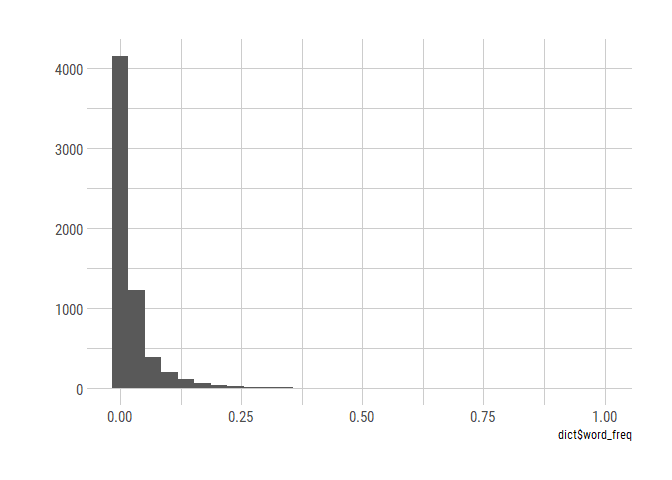
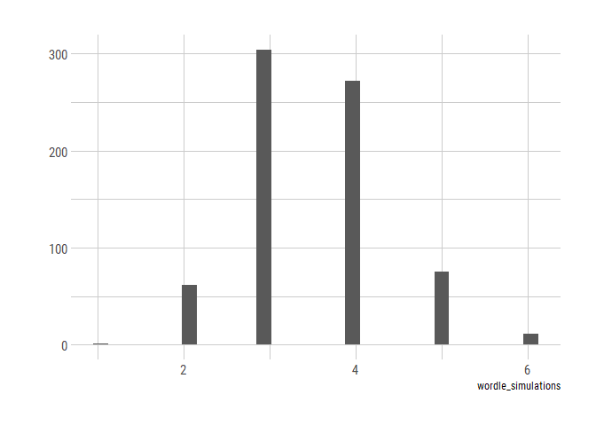

Оптимизация стратегии Wordle
================

-   [Загрузка данных](#загрузка-данных)
-   [Каков план?](#каков-план)
-   [Реализуем алгоритм](#реализуем-алгоритм)
-   [Симуляция игры](#симуляция-игры)

## Загрузка данных

Первым делом мы загрузим словари, которые использует [русская версия
wordle](https://wordle.belousov.one). Как и оригинальная версия, русская
использует два словаря: словарь загаданных слов и словарь доступных для
ввода.

Мы, конечно же, могли бы использовать первый и побеждать быстрее. Но это
было бы совсем обманом. В таком случае проще по текущей дате узнавать,
какое слово загадано и угадывать с первой попытки.

Использование второго словаря, на мой взгляд, справедливо. Wordle сам
указывает на слова, которые не знает и мы могли бы просто скормить в
него любой доступный словарь и нафильтровть слова, которые ему известны.

Оба словаря мы извлекаем из исходного кода веб-приложения и сохраняем
как вектора. Словарь загаданных слов анализируем ровно в той мере, в
которой его мог проанализировать обычный игрок и используем для
симуляций.

``` r
dict <- list(
  words_ru = "./data/ru_wordle_possible.txt",
  words_winning_ru = "./data/ru_wordle_targets.txt"
) %>% 
  map(RcppSimdJson::fload) %>% 
  map(unique) %>% 
  map(~ .[str_length(.) == 5])

print("Есть ли среди загаданных слов такие, которых нет в общем?")
```

    ## [1] "Есть ли среди загаданных слов такие, которых нет в общем?"

``` r
print(if_else(any(!dict$words_winning_ru %in% dict$words_ru), "Да", "Нет"))
```

    ## [1] "Нет"

Быстрый взгляд на словарь загаданных слов (или несколько игр в wordle)
наводят на мысль, что загадываются только (или в основном)
существительные и, опять же в основном, общеупотребительные. Никакой
специальной лексики или жаргона.

Используем эту информацию себе во благо и заложим её в алгоритм.

Для наших целей нам понадобится [частотный словарь русского
языка](http://dict.ruslang.ru/freq.php), который мы сразу же сопоставим
с нашим словрём wordle.

``` r
word_freqs_raw <- read_tsv("./data/freqrnc2011.csv",
                           show_col_types = FALSE) %>%
  transmute(lemma = str_to_lower(str_squish(Lemma)),
            freq = `Freq(ipm)`) %>%
  filter(lemma %in% dict$words_ru) %>%
  group_by(lemma) %>%
  summarise(freq = sum(freq), .groups = "drop") %>%
  deframe()

head(word_freqs_raw)
```

    ## аббат абвер абзац аборт абрек абрис 
    ##   1.6   2.7  10.2   8.3   1.3   1.1

``` r
qplot(word_freqs_raw)
```

    ## `stat_bin()` using `bins = 30`. Pick better value with `binwidth`.

<!-- -->

Мы планируем взвешивать слова по их частоте в словаре и текущее
распределение, на мой взгляд, слишком смещенное для такой задачи. Мы
возьмём поделим частоту (ipm) на максимальное значение и возьмём
квадратный корень, чтобы немного сгладить картинку.

Частоты слов, которые есть в нашем словаре, но не встречаются в
частотном мы заменим на минимальную частоту, предполагая что они не
попали в словарь из-за недостаточной встречаемости.

``` r
word_freqs_raw <- sqrt(word_freqs_raw / max(word_freqs_raw))

dict$word_freq <- rep(min(word_freqs_raw, na.rm = TRUE),
                      times = length(dict$words_ru))
names(dict$word_freq) <- dict$words_ru
dict$word_freq[names(word_freqs_raw)] <- word_freqs_raw

qplot(dict$word_freq)
```

    ## `stat_bin()` using `bins = 30`. Pick better value with `binwidth`.

<!-- -->

Для выделения существительных в словаре мы проставляем теги через udpipe
(словарь SynTagRus) и уменьшим вес всех не-существительных в два раза.

Мы могли бы удалить все не-существительные из словаря вовсе, но не
делаем этого по двум причинам:

1.  Не все слова среди целевых могут быть существительными (или позже
    могут добавиться не-существительные)
2.  UPOS-теги в SynTagRus могут быть ошибочными и мы рискуем удалить
    валидные слова

Более сильная пенализация не-существительных ухудшает показатели в
симуляции, поэтому останвливаемся на двухкратной. Но стоит заметить, что
вся регуляризация здесь делалась “на глаз” и полноценные симуляции с
оптимизацией веса частотности слов и частей речи может дать лучший
результат.

``` r
model_ud <- udpipe::udpipe_download_model("russian-syntagrus",
                                          model_dir = "./data",
                                          overwrite = FALSE)

words_ud <- udpipe::udpipe(x = dict$words_ru,
                           object = model_ud,
                           parallel.cores = 4, parser = "none",
                           tokenizer = "vertical")

dict$word_freq[words_ud$upos != "NOUN"] <-
  dict$word_freq[words_ud$upos != "NOUN"] / 2
```

## Каков план?

План - создать алгоритм, выдающий слова, которые сильнее всего уменьшают
неопределенность, иными словам дают больше всего единиц информации.
Единиц информации в нашем случае - количество слов, которые мы можем
исключить в следующих ходах. Для этого мы будем минизировать значение по
[формуле Шеннона](https://ru.wikipedia.org/wiki/Информационная_энтропия)

## Реализуем алгоритм

Алгоритм выглядит следующим образом:

1.  Для всех слов создаём токены - n-граммы длинной от 1 до 4 (5 -
    максимально количество букв в wordle, но нам не нужны 5-граммы, так
    как им всегда будет соответствовать только одно слово)

-   Мы используем n-граммы разной длины, чтобы три интересующих нас
    источника информации о будущих словах:
    -   Наличие конкретной буквы
    -   Соотнесение буквы с стоящими перед ней и как следствие её
        позиция в n-грамме

2.  Создаём матрицу, в которой отмечаем наличие токена \[0;1\] в слове
3.  Все единицы в матрице заменяем на долю слов, в которых встречается
    этот токен

-   Слова при этом взвешиваем по ранее установленным весам от частоты
    употребления и части речи

4.  Полученные частоты (вероятности) умножаем на собственный логарифм
5.  Находим сумму для каждого слова умноженную на -1 и таким образом
    получаем энтропию по формуле Шеннона
6.  Сортируем слова по убыванию меры энтропии и выбираем самое полезное
    из них

Я испробовал несколько вариантов кодирования слов:

-   Использование только букв, без их позиций
-   Использование букв с их позициями (например токен “а2” соответствует
    слову с буквой “а” на второй позиции)

И несколько способов объединения слов в n-граммы:

-   Созданием n-грамм с длинами от 1 до n-1
-   Создание n-грамм с пропусками размера от 0 до n-1

Использование позиций в любых комбинациях увеличивало среднее количество
ходов до победы. Использование пропусков не вносило значимые изменения в
количество ходов. Ограниечние размера n-грамм меньше, чем n-1 также
увеличивало среднее количество ходов до победы.

Заметка по коду ниже: так как наш подход через n-граммы неминуемо
создаст разреженную матрицу, все операции далее производятся при помощи
пакета {Matrix}

``` r
sweep_sparse <- function(x, margin, stats, fun = "*") {
  # @author: David Pinto
  # https://stackoverflow.com/a/58243652
  f <- match.fun(fun)
  if (margin == 1) {
    idx <- x@i + 1
  } else {
    idx <- x@j + 1
  }
  x@x <- f(x@x, stats[idx])
  return(x)
}

weight_dfm <- function(x, weights) {
  force(weights)
  weight <- rep(1, ndoc(x))
  names(weight) <- docnames(x)
  weights <- weights[names(weights) %in% names(weight)]
  weight[match(names(weights), names(weight))] <- weights
  sweep_sparse(x, 1, weight, "*")
}

rank_words <- function(words, .dfm, word_freq = dict$word_freq) {
  .dfm <- .dfm[match(words, docnames(.dfm)), ]
  
  if (!gtools::invalid(word_freq)) {
    .dfm <- weight_dfm(.dfm, weights = word_freq)
  }else{
    word_freq <- rep(1, times = nrow(.dfm))
  }
  
  toks_weights <- colSums(.dfm) / sum(word_freq)
  .dfm <- as(.dfm, "dgTMatrix")
  
  wordscores <- sweep_sparse(.dfm, 2, toks_weights, fun = "*")
  wordscores@x <- wordscores@x * log(wordscores@x)
  wordscores <- -rowSums(wordscores, na.rm = TRUE)
  
  names(wordscores) <- words
  sort(wordscores, decreasing = TRUE, method = "radix")
}

create_dfm <- function(words, nchar = 5) {
  toks <- words %>%
    set_names() %>%
    quanteda::tokens(what = "character") %>%
    quanteda::tokens_ngrams(n = seq_len(nchar - 1),
                            concatenator = "")
quanteda::dfm(toks) %>%
    quanteda::dfm_weight("boolean")
}
```

В целях оптимизации производительности, держим document-feature matrix
вне функции ранжирования слов.

``` r
wordle_dfm <- create_dfm(dict$words_ru)
head(wordle_dfm)
```

    ## Document-feature matrix of: 6 documents, 15,450 features (99.92% sparse) and 0 docvars.
    ##        features
    ## docs    а н т аа ан нт та аан ант нта
    ##   аанта 1 1 1  1  1  1  1   1   1   1
    ##   абаза 1 0 0  0  0  0  0   0   0   0
    ##   абази 1 0 0  0  0  0  0   0   0   0
    ##   абайя 1 0 0  0  0  0  0   0   0   0
    ##   абака 1 0 0  0  0  0  0   0   0   0
    ##   абвер 1 0 0  0  0  0  0   0   0   0
    ## [ reached max_nfeat ... 15,440 more features ]

Вот так выглядят оптимальные слова для первого хода:

``` r
head(rank_words(dict$words_ru, .dfm = wordle_dfm))
```

    ##    место    время    такой    закон    народ    конец 
    ## 1.847138 1.784038 1.692097 1.504860 1.492816 1.481057

## Симуляция игры

Для симуляции мы воспользуемся пакетом
[{coolbutuseless/wordle}](https://github.com/coolbutuseless/wordle) На
каждом ходу мы будем использовать лучшее из доступных слов. Словарь
будем постепенно уменьшать, оставляя только валидные слова.

``` r
source("./R/zzz_wordle_sim.R", encoding = "UTF-8")

progressr::handlers(list(
  progressr::handler_progress(
    format = ":spin :current/:total (:message) [:bar] :percent in :elapsed ETA: :eta",
  )
))

plan(multisession)
# put inside progressr::with_progress to see progress and ETA
wordle_simulations <-
  wordle_sim(
    dict$words_ru,
    dict$words_winning_ru,
    .dfm = wordle_dfm,
    word_weights = dict$word_freq
  )
plan(sequential)
```

Как мы видим, алгоритм справляется в среднем за 3.5 хода. Медиана - 3.
При этом, ни в одном из слов количество шагов не привысило 6
(максимальное в стандартных правилах).

``` r
mean(wordle_simulations)
```

    ## [1] 3.53931

``` r
median(wordle_simulations)
```

    ## [1] 3

``` r
table(wordle_simulations)
```

    ## wordle_simulations
    ##   1   2   3   4   5   6 
    ##   1  62 304 272  75  11

``` r
qplot(wordle_simulations)
```

    ## `stat_bin()` using `bins = 30`. Pick better value with `binwidth`.

<!-- -->

Я считаю, что это успешный успех. Если у вас есть предложения по
улучшению алгоритма - добро пожаловать в issues.
